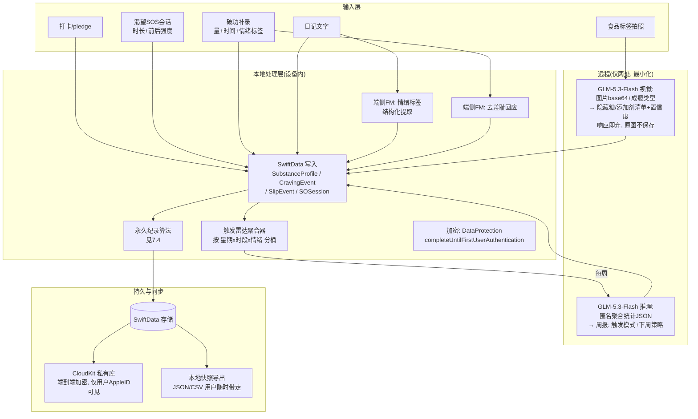

# TR-20260916-Curtail戒瘾操作指南

> **文档性质**：可复刻级研发操作指南（任意LLM可直接照此实现）
> **复刻对象**：Stoppr（戒瘾多场景App，Starter Story验证 $12K MRR）
> **目标市场**：🇺🇸 美国 iOS 优先
> **报告日期**：2026-09-16
> **调研渠道**：pain-point-hunter SKILL（Tavily/WebSearch/Reddit/App Store评论）+ GitHub MCP + sequential-thinking 结构化分析

---

# ⭐ 第一部分：APP命名（已查重，App Store 无同名应用）

## 1.1 最终命名

| 项目 | 内容 | 说明 |
|---|---|---|
| **APP 名称** | **Curtail** | 英文动词"削减、收敛、克制"，一词双关：削减成瘾、收敛渴望 |
| **副标题（Subtitle，30字符内）** | **Quit Sugar, Alcohol & More** | 26字符，携带 quit/sugar/alcohol 三大高流量ASO关键词 |
| **营销口号（截图/官网/TikTok用）** | **Nothing resets. Nothing lost.** | 直击品类第一痛点"破功清零"，病毒传播句 |
| **品类** | Health & Fitness | Age Rating 13+（含成瘾内容提及） |

## 1.2 命名五维分析

| 维度 | 分析 | 评分 |
|---|---|---|
| **品牌记忆度**（最关键） | Curtail 是真实英文单词但极少被用作品牌，品类内零撞名；两音节 /kərˈteɪl/，重音在尾，发音干脆；语义自带"克制"情绪，用户看一次能复述 | 9.5/10 |
| **ASO搜索优化** | 主名虽无关键词，副标题+关键词字段（sober, sobriety, craving, streak, vape, nicotine, tracker, detox, urges, counter, drink less, sugar free）全量覆盖；品类搜索词"quit"竞争极度激烈，差异化品牌词"Curtail"独占流量，长尾词靠副标题承接 | 9/10 |
| **功能描述性** | "curtail"词义=to cut back/reduce，同时覆盖"完全戒断"与"减量"两种目标（竞品 I Am Sober 只做戒断二元化是痛点）；用户望文即知用途 | 9/10 |
| **情感共鸣** | 不带羞耻、不带战斗感（对比 Craveless/Crush/Beat），是"温和的控制感"——契合去羞耻化产品哲学；社区可自创动词："I curtailed the craving" | 9/10 |
| **国际化适配** | 拼写无歧义、无俚语歧义、无宗教/文化禁忌；西语/法语/德语用户均可发音；图标+单词可脱离语言传播 | 9/10 |

## 1.3 病毒传播设计

- **传播句式**（TikTok/Reddit/分享卡）：
  - "Curtail the craving."（把渴望收住）
  - "Nothing resets. Nothing lost."（什么都不清零）
  - "Your longest streak is permanent."（最长纪录永久保留）
- **分享卡机制**：里程碑卡片自动生成，展示"最长纪录（永久）+ 当前段天数 + 骑掉的渴望数"，社交货币设计——用户晒的是"累计成就"而不是"我几天没碰"（对比竞品晒streak引发他人破功羞耻）。
- **命名查重记录（2026-09-16）**：以下名称已确认被占用，**严禁使用**：Stoppr、I Am Sober、Reframe、Quitzilla、Sipless、Quitvana、QuitSugr、Sober Tracker、Sober Time、Sober Tool、EasyQuit、DrinkControl、Quitter、Urge Surfer、Urge Surfin、Urge: Control、Crest、Calm、Steady（×3款）、Craveless、CraveLess.Me、Cravely、Quitly、Days Since、Loosid、Sunnyside、Sober Sidekick、My QuitBuddy、Craving To Quit、Crush The Crave、Smoke Free、quitSTART、EverLine、Tidepool。**Curtail 经 apps.apple.com 定向检索确认零命中。**
- **备选名**（若审核阶段撞名）：Tidekeeper / SlipProof / Rootline / Waveless。

---

# 第二部分：市场机会与竞品现状

## 2.1 Stoppr 现状（复刻对象的衰退窗口）

| 指标（whatsthe.app，RevenueCat验证，2026-09-16更新） | 数值 | 解读 |
|---|---|---|
| MRR | **$822**（28天环比 **-27.7%**） | 从 $12-14K 峰值暴跌，付费墙驱动增长已失效 |
| 近28天下载 | **22 次**（iOS+Android合计） | 分发停滞，无自然量 |
| 活跃订阅 | 293（ARPPU $2.81） | 靠低单价周订阅撑量 |
| 评分 | iOS 4.5 / Play 3.9（869条） | 产品力尚可但增长模型崩塌 |
| 技术栈 | Flutter + Firebase + RevenueCat | 创始人 David Attias，vibe-coded，14天上线 |

**结论**：Stoppr 的打法是"克隆+付费墙AB测试+季节皮肤（万圣节）"，无真实产品壁垒；其衰退证明该品类**分发红利结束、产品力时代开始**。窗口：用"解决品类第一痛点"的产品+透明定价+ASO长尾切入。

## 2.2 竞品矩阵（2026-09 实测）

| 竞品 | 定价 | 核心缺陷（差评/Reddit原证） | 我们的反制 |
|---|---|---|---|
| Reframe | $99.99/年 | 取消难（Trustpilot 2026-08："Can't cancel my subscription...IMPOSSIBLE"）、信息过载（"cluttered and overwhelming"）、取消后仍被扣费 | 一键取消+极简首页+明码标价 |
| I Am Sober | 免费+$39.99/年 | 二元化（只做戒断）、激励包重复、笔记字数限制 | 戒断/减量双模式+AI生成永不重复 |
| Stoppr | 周订阅+年订（80%折扣钩） | 增长崩塌、单成瘾（戒糖）、触发记录缺失 | 多成瘾档案+触发雷达 |
| Sipless | 月/年订阅 | 差评："8 subscriptions of multiple apps"（订阅捆绑诈骗感） | 单一订阅+无捆绑 |
| Steady（3款同名） | 免费/年订/Pro | 功能分散（sugar版、sobriety版割裂） | 一个App全场景 |
| Urge Surfer（AGPL开源） | 免费 | 只有冲浪计时，无追踪/洞察/成长体系 | SOS+完整成长系统 |
| Quitzilla | $29.99/年 | 免费层仅2个成瘾 | 免费层3档案+AI |

## 2.3 痛点研究结论（pain-point-hunter 采集，附原话）

| # | 痛点 | 用户原话（来源） | Curtail 解法 |
|---|---|---|---|
| P1 | **streak羞耻与进度清零** | "Counter apps always triggered me bc it's like oh i'm 7 days clean... they make me feel horrible for relapsing because it looks like all of my progress is just erased"（Reddit r/MadeOfStyrofoam） | **永久纪录算法**：破功只重置"当前段"，最长纪录/累计克制次数/成长花园永不归零 |
| P2 | **渴望来临App帮不上忙** | "The average craving supposedly lasts for 20 minutes"（Reframe机制验证）+ 行业结论"app-only approaches achieve long-term success rates below 10%" | **渴望SOS舱**：3秒进入，20分钟冲浪计时+AI教练+呼吸引导，**离线可用**（端侧模型），SOS界面零streak零判断 |
| P3 | **破功后不敢诚实记录** | "in case you relapse lets you put in the number of drinks you had"（DrinkControl用户点赞此功能=稀缺） | **1滑2问补录**：<10秒记录破功，AI回应零羞耻（端侧生成），数据进触发雷达 |
| P4 | **打开App=触发渴望** | "Every time you open the app to check your progress... you then get a craving"（PuffCount用户） | 首页默认不显示大数字倒计时，显示花园生长+今日一句；streak收进次级页 |
| P5 | **不能修改昨天记录** | 习惯/戒断类目最高赞差评（119👍，HabitKit案） | 全部历史可编辑，7天内补记无标记，7天外标"补记" |
| P6 | **多成瘾共病数据不通** | Stoppr痛点原案："每种成瘾一个App，数据不通" | 一App多档案并行（糖/酒/烟/电子烟/购物/短视频/自定义），统一渴望时间线 |
| P7 | **欺骗性订阅** | 全品类差评第一名；Reframe/Sipless/Cal AI被下架案例 | 透明定价页+一键取消+免费层真可用 |
| P8 | **缺触发场景洞察** | Stoppr原案："触发场景记录多数产品缺失" | **触发雷达**：时间×情绪×地点热力图（本地计算），AI周报解读 |
| P9 | **缺替代仪式** | Stoppr原案 + 学术"self-control apps评分>motivational apps"（PMC8750483） | SOS完成即解锁"替代仪式卡"（20个俯卧撑/冷水/散步/口香糖…按成瘾类型定制） |

---

# 第三部分：产品战略

## 3.1 一句话定位

> **Curtail 是第一台"渴望急救机"——渴望来的那20分钟里，3秒内给你工具；破功不清零，成长看得见。**

## 3.2 三大体验支柱

1. **Rescue（渴望SOS舱）**：最高优先级入口。大按钮 → 20分钟冲浪计时 → 端侧AI教练对话（离线）→ 呼吸动画 → 替代仪式卡。全程 ≤3 次点击，永不显示羞耻信息。
2. **Honest Log（去羞耻记录）**：破功=数据点（Data Point），不是失败（Relapse）；滑一下补录；所有记录可改；永久纪录+当前段双轨制。
3. **Grow（成长花园+触发雷达）**：每天保持即浇水，花园渐茂盛（参考开源 sober 项目虚拟花园机制）；渴望热力图揭示"周五晚8点+压力=渴望高峰"；AI周报（GLM推理）给出下周策略。

---

# 第四部分：实现流程图（系统架构）

```mermaid
flowchart TB
    subgraph Client["📱 iOS App（SwiftUI, iOS 26+）"]
        UI[SwiftUI 视图层]
        BIZ[业务逻辑层 Swift 严格并发]
        SD[(SwiftData 本地库<br/>加密、本地优先)]
        SOSM[SOS 急救模块<br/>离线可用]
        GARDEN[花园渲染模块<br/>Canvas/TimelineView]
        RADAR[触发雷达<br/>本地聚合计算]
    end

    subgraph Apple["🍎 Apple 免费AI（Foundation Models框架, 端侧3B, 零成本）"]
        FM1[SOS教练对话<br/>@Generable结构化]
        FM2[情绪/触发标签提取<br/>content tagging]
        FM3[去羞耻回应文案<br/>破功补录后生成]
        FM4[每日微洞察<br/>一句话]
    end

    subgraph Cloud["☁️ GLM-5.3-Flash（api.z.ai, 按需付费）"]
        GLM1[食品标签视觉扫描<br/>隐藏糖识别]
        GLM2[每周深度洞察报告<br/>reasoning_effort=max]
    end

    subgraph Sys["⚙️ 系统能力"]
        CK[CloudKit 私有库同步<br/>无账号体系]
        SK[StoreKit 2 订阅]
        WG[WidgetKit + Live Activity<br/>SOS快速入口]
        WT[watchOS App<br/>手腕SOS]
        UN[UNUserNotificationCenter<br/>精确本地通知]
    end

    UI --> BIZ --> SD
    BIZ --> SOSM --> FM1
    BIZ --> FM2
    BIZ --> FM3
    BIZ --> FM4
    BIZ -->|仅图片+最小上下文| GLM1
    BIZ -->|聚合统计(匿名)| GLM2
    SD --> CK
    SK --> BIZ
    WG --> SOSM
    WT --> SOSM
    UN --> BIZ
```

**架构规则（实现时必须遵守）**：
1. 本地优先：断网时全功能可用（除GLM视觉/周报），联网后补同步。
2. GLM请求最小化：只发送"图片+产品名候选+成瘾类型"三个字段，不携带任何用户标识与历史数据；响应即用即弃，不落库原图（只存结构化结果）。
3. 端侧模型兜底：所有AI功能必须有"离线降级文案包"（预置20组教练回应模板）。
4. 无分析SDK、无广告SDK、无第三方崩溃收集（用MetricKit系统级方案）。

---

# 第五部分：用户使用流程图（爽感设计核心）

## 5.1 首次启动（30秒到价值，无强制注册）

```mermaid
flowchart LR
    A[打开App] --> B{选想改变的事<br/>大图标点选: 糖/酒/烟/电子烟/<br/>购物/短视频/自定义}
    B --> C[选模式: 完全戒断 or 逐步减量<br/>一句话解释, 默认戒断]
    C --> D[设起始日: 就今天 / 我其实已经<br/>X天了(可回溯,尊重真实历史)]
    D --> E[选提醒时段: 跳过=不发通知<br/>发通知=发什么自己挑]
    E --> F[ garden种子动画 +<br/>'Nothing resets. Nothing lost.']
    F --> G[✅ 完成, 进入首页<br/>全程无注册无邮箱无付费墙弹窗]
```

**爽感关键**：3次点击完成设置；付费墙**永远不主动弹**（首次SOS完成后第3天、且用户已获得价值时才出现一次升级卡）。

## 5.2 渴望SOS（品类核心场景，≤3次点击，<3秒进入工具态）

```mermaid
flowchart LR
    A[渴望来袭<br/>锁屏Widget/手表/App大按钮] --> B[SOS舱: 全屏波浪呼吸动画<br/>⏱ 20分钟冲浪计时自动开始<br/>无streak/无天数/无判断]
    B --> C{想说话吗?}
    C -->|是| D[打字/语音: Apple端侧AI教练<br/>共情+冲浪引导, 离线可用]
    C -->|否| E[纯计时: 波浪起伏+进度光效]
    D --> F[计时结束: 渴望强度滑条<br/>(来时 9 → 现在 ?)]
    E --> F
    F --> G[🎉 你骑过了这一浪<br/>+1 累计克制 / 花园获得一朵花]
    G --> H[可选: 替代仪式卡<br/>20俯卧撑/冷水洗脸/散步10分钟]
    H --> I[可选: 记录触发<br/>何时/何地/何感 3秒3滑条]
```

**爽感关键**：SOS界面刻意"什么都没有"——没有天数、没有曲线、没有升级提示；结束时把"忍住"转译成正向资产（花+1、克制+1）， dopamine 落在成就上而不是焦虑上。

## 5.3 破功补录（去羞耻核心，10秒）

```mermaid
flowchart LR
    A[首页小入口: +记录一口/一次] --> B[滑条: 摄入量/次数]
    B --> C[两问: 什么时候?<br/>什么感觉? (点选标签)]
    C --> D[Apple AI生成回应:<br/>永远零羞耻+一个洞察+一个下次策略]
    D --> E[📊 展示: 当前段重置, 但<br/>最长纪录/累计天数/花园 全部保留]
    E --> F[可选: 一键把此次写进触发雷达]
```

**文案铁律**：全程禁止出现 "relapse / failed / reset to zero / 毁了" 等词；用 "current chapter ended / data point / new lap"。

## 5.4 日常使用（每天60秒）

早1次pledge（可选）→ 晚1次10秒check-in（今天如何？点选）→ 每周一收AI洞察报告（GLM生成）→ 花园随手看一眼。**全App无无限滚动设计**（对齐Floga验证过的极简承诺），每个页面都是"看完就能走"。

---

# 第六部分：软件数据流图

## 6.1 核心数据流（含AI调用与隐私边界）



## 6.2 数据不出设备的保障（隐私=卖点）

- 唯二离开设备的：①用户主动拍的标签照片（发给GLM时剥离EXIF与身份）②每周匿名聚合统计（仅数值：次数/时段分布/强度均值，无文本日记、无定位坐标——地点只用"家/公司/外出/车"这类用户自选分类，不用GPS）。
- Info.plist 权限最小化：相机（扫描用）、通知；**不申请定位**（地点用用户自选标签，既隐私又够用）。

---

# 第七部分：核心技术实现代码示例

> 环境：Xcode 26+ / Swift 6 / SwiftUI / iOS 26+（Foundation Models 要求）/最低部署 iOS 18（对FM功能做可用性守卫，老设备走模板降级）。
> 可二次开发参考项目见第12节。

## 7.1 数据模型（SwiftData）

```swift
import SwiftData
import Foundation

@Model
final class SubstanceProfile {
    var id: UUID = UUID()
    var name: String                      // "Sugar", "Alcohol", 自定义...
    var icon: String                      // SF Symbol 名
    var mode: ProfileMode                 // .abstinence / .taper
    var createdAt: Date = .now
    // 永久纪录双轨制核心字段
    var currentLapStart: Date = .now      // 当前段起点（破功时重置）
    var longestCleanSeconds: TimeInterval = 0   // 历史最长（永不重置）
    var totalRiddenCravings: Int = 0      // 累计骑过的渴望数（永不重置）
    var totalCleanSecondsEver: TimeInterval = 0 // 累计干净时长（永不重置）
    var gardenSeed: Int = Int.random(in: 0...999) // 花园随机种子
    @Relationship(deleteRule: .cascade) var events: [LifeEvent] = []
}

enum ProfileMode: String, Codable { case abstinence, taper }

@Model
final class LifeEvent {
    var id: UUID = UUID()
    var kind: EventKind                   // .cravingRidden / .slip / .pledge / .checkIn
    var timestamp: Date = .now
    var intensityBefore: Int?             // 渴望来时 1-10
    var intensityAfter: Int?              // 冲浪后 1-10
    var quantity: Double?                 // 破功摄入量
    var emotionTag: String?               // stress/bored/social/...（端侧FM可自动打标）
    var placeTag: String?                 // home/work/out/car（用户自选，不用GPS）
    var note: String?
    var editedAt: Date?                   // 支持修改历史（修复品类第一痛点）
    var profile: SubstanceProfile?
}

enum EventKind: String, Codable { case cravingRidden, slip, pledge, checkIn }
```

## 7.2 永久纪录算法（产品灵魂，无歧义实现）

```swift
struct StreakMath {
    /// 返回当前段时长。破功 = 结束当前段开新段；历史与纪录永不清零。
    static func lapDuration(_ p: SubstanceProfile, now: Date = .now) -> TimeInterval {
        now.timeIntervalSince(p.currentLapStart)
    }

    /// 记录破功：结算当前段 → 更新最长纪录 → 开新段
    @MainActor
    static func applySlip(to p: SubstanceProfile, at date: Date = .now, context: ModelContext) {
        let lapLen = date.timeIntervalSince(p.currentLapStart)
        p.totalCleanSecondsEver += lapLen
        p.longestCleanSeconds = max(p.longestCleanSeconds, lapLen)
        p.currentLapStart = date                  // 新段从此刻开始，而不是"归零"
        try? context.save()
    }

    /// 骑过一次渴望
    @MainActor
    static func applyRiddenCraving(to p: SubstanceProfile, context: ModelContext) {
        p.totalRiddenCravings += 1
        try? context.save()
    }

    /// 7天内可无痕补记，7天外补记打标记（数据诚实性）
    static func isBackfillMarked(eventDate: Date, now: Date = .now) -> Bool {
        now.timeIntervalSince(eventDate) > 7 * 86400
    }
}
```

## 7.3 渴望SOS教练（Apple端侧模型，离线，零成本）

```swift
import FoundationModels

@Generable
struct CoachTurn {
    @Guide(description: "One short empathetic sentence, max 12 words, zero judgment, zero shame")
    var empathy: String
    @Guide(description: "One concrete urge-surfing instruction, max 15 words")
    var instruction: String
    @Guide(description: "true if user should be praised for checking in")
    var isPositive: Bool
}

final class SOSCoach {
    private var session: LanguageModelSession?

    func prepare() {
        guard LanguageModelSession.isAvailable else { return }   // 老设备走模板降级
        session = LanguageModelSession(instructions: """
        You are a calm, warm craving-surfing coach. Rules:
        - NEVER mention streaks, days, failure, relapse, guilt.
        - Techniques allowed: urge surfing, box breathing, 5-4-3-2-1 grounding,
          delayed gratification, urge = wave metaphor.
        - Keep each reply under 30 words total. English only.
        """)
    }

    func reply(to userText: String) async throws -> CoachTurn {
        guard let session else { return Self.fallback() }        // 离线降级
        return try await session.respond(to: userText,
                                         generating: CoachTurn.self).content
    }

    static func fallback() -> CoachTurn {
        CoachTurn(empathy: "This wave is real. So is your seat on the board.",
                  instruction: "Breathe in 4, hold 4, out 6 — three rounds. I'm timing with you.",
                  isPositive: true)
    }
}
```

## 7.4 食品标签扫描（GLM-5.3-Flash 视觉，OpenAI兼容）

```swift
import UIKit

struct LabelScanResult: Codable {
    struct SugarHit: Codable { let name: String; let aliases: [String] }
    let productGuess: String
    let hiddenSugars: [SugarHit]        // 隐藏糖别名（麦芽糊精/果汁浓缩液等50+词表）
    let totalSugarAliasesFound: Int
    let severity: String                // low / medium / high
    let confidence: Double              // 0-1, 低置信度时UI提示"重新拍或手动选"
    let oneLineAdvice: String
}

enum GLMFlash {
    static let endpoint = URL(string: "https://api.z.ai/api/paas/v4/chat/completions")!
    // BigModel 的 Key 在 api.z.ai 端点直接可用（智谱已统一 Key 体系）
    static func scanFoodLabel(imageJPEG: Data, addiction: String, apiKey: String) async throws -> LabelScanResult {
        let b64 = imageJPEG.base64EncodedString()
        let body: [String: Any] = [
            "model": "glm-5.3-flash",
            "temperature": 1, "top_p": 0.95,
            "messages": [[
                "role": "user",
                "content": [
                    ["type": "image_url",
                     "image_url": ["url": "data:image/jpeg;base64,\(b64)"]],
                    ["type": "text",
                     "text": """
                     This is a US food/beverage nutrition label photo. User is quitting \(addiction).
                     1) Identify product. 2) List EVERY sugar alias in ingredients (use this vocabulary: sucrose, dextrose, maltose, maltodextrin, corn syrup, high-fructose corn syrup, fruit juice concentrate, cane juice, molasses, honey, agave, rice syrup, evaporated cane juice, barley malt, dextrin, ...).
                     3) Rate severity for someone quitting sugar. 4) Give one-line advice.
                     Respond ONLY as JSON: {"productGuess":"","hiddenSugars":[{"name":"","aliases":[]}],"totalSugarAliasesFound":0,"severity":"low|medium|high","confidence":0.0,"oneLineAdvice":""}
                     """]
                ]
            ]]
        ]
        var req = URLRequest(url: endpoint)
        req.httpMethod = "POST"
        req.setValue("application/json", forHTTPHeaderField: "Content-Type")
        req.setValue("Bearer \(apiKey)", forHTTPHeaderField: "Authorization")
        req.httpBody = try JSONSerialization.data(withJSONObject: body)
        let (data, _) = try await URLSession.shared.data(for: req)
        // 解析 choices[0].message.content → JSONDecoder 解 LabelScanResult
        let raw = try JSONSerialization.jsonObject(with: data) as? [String: Any]
        let choices = raw?["choices"] as? [[String: Any]] ?? []
        let msg = (choices.first?["message"] as? [String: Any])?["content"] as? String ?? "{}"
        let jsonStr = String(msg.drop { $0 != "{" })           // 剥离可能的markdown围栏
        return try JSONDecoder().decode(LabelScanResult.self,
                                        from: Data(jsonStr.utf8))
    }
}
```

**成本核算**：单次扫描 ≈ 标签图~700 token + 输出~200 token ≈ `$0.075×0.0007 + $0.25×0.0002 ≈ $0.0001`。即使用户每天扫10次、月成本 < $0.03/人 → 每月30次/人的Pro配额成本可忽略，配额主要用于防滥用而非成本。

## 7.5 订阅（StoreKit 2，透明化实现）

```swift
import StoreKit

@MainActor @Observable
final class Paywall {
    var pro: Product.SubscriptionInfo?
    static let monthlyID  = "com.curtail.pro.monthly"    // $4.99
    static let yearlyID   = "com.curtail.pro.yearly"     // $29.99 主推
    static let trialDays  = 7

    func loadAndPurchase() async throws -> Bool {
        let products = try await Product.products(for: [Self.monthlyID, Self.yearlyID])
        guard let yearly = products.first(where: { $0.id == Self.yearlyID }) else { return false }
        let result = try await yearly.purchase()
        switch result {
        case .success(let verification):
            let txn = try checkVerified(verification)
            await txn.finish()
            return true
        case .userCancelled, .pending: return false
        @unknown default: return false
        }
    }
    // 一键取消指引: UIApplication.open("itms-apps://apps.apple.com/account/subscriptions")
    // 这是把"取消难"竞品痛点变成卖点: 设置页放"Manage subscription"直达按钮
}
```

## 7.6 SOS 快速入口（Widget + Live Activity + Watch）

```swift
// WidgetKit: 锁屏 SOS 按钮 — App Intent 直达 SOS 舱, 0 次导航
import WidgetKit
import AppIntents

struct StartSurfIntent: AppIntent {
    static let title: LocalizedStringResource = "Start Surfing"
    @MainActor func perform() async throws -> some IntentResult {
        SOSRouter.openSOS()           // 深链进 SOS 全屏, 自动开始 20min 计时
        return .result()
    }
}

// Live Activity: 计时期间锁屏/灵动岛实时显示波浪进度
// watchOS: 手腕上 1 个大按钮 + 触觉反馈 + 15s 微呼吸, 手机不在身边也能冲浪
```

---

# 第八部分：AI 能力规划与成本模型

| 能力 | 引擎 | 免费层 | Pro层 | 单次成本 | 离线 |
|---|---|---|---|---|---|
| SOS教练对话 | Apple FM 端侧 | 5次/天 | **无限** | $0 | ✅ |
| 情绪/触发自动打标 | Apple FM content tagging | 无限 | 无限 | $0 | ✅ |
| 破功去羞耻回应 | Apple FM | 无限 | 无限 | $0 | ✅ |
| 每日一句微洞察 | Apple FM | 无限 | 无限 | $0 | ✅ |
| 食品标签隐藏糖扫描 | **GLM-5.3-Flash 视觉** | 2次/月 | 30次/月 | ~$0.0001 | ❌ |
| 每周深度洞察报告 | **GLM-5.3-Flash 推理**(reasoning_effort=max) | ❌ | 4次/月 | ~$0.01 | ❌ |

- API Key 策略：GLM Key 由开发者持有（BYO-Server 而非 BYO-Key，用户零配置），Key 放自有轻代理或直接内嵌+域名级限额（Z.ai 支持限额与用量监控）；BigModel Key 可直接调 `api.z.ai` 端点（智谱统一Key体系，已验证文本✓视觉✓）。
- 竞争逻辑：**免费层给"真AI"（端侧无限次情绪打标与去羞耻回应）**——竞品免费层连基础追踪都限2个成瘾；Pro层给"重AI"（视觉+推理）制造升级动机。Apple FM 零成本让我们敢无限送，这是 Flutter/Firebase 竞品（每次调用都烧钱）做不到的结构性优势。

---

# 第九部分：价格策略（详细）

## 9.1 模式选择：站内订阅B（免费下载+免费层+7天试用Pro+月/年订阅；禁用买断，因GLM为消耗品）

| 档位 | 价格 | 内容 | 设计意图 |
|---|---|---|---|
| **Free** | $0 | 3个戒断档案、全部追踪/永久纪录算法、渴望SOS舱（端侧AI每日5次）、花园、破功补录、数据导出、**无广告** | 引流+真价值，免费层即可解决P1/P2/P3 |
| **Pro 月付** | $4.99/月（7天免费试用） | 全部Pro | 短期决心用户 |
| **Pro 年付（主推）** | **$29.99/年**（7天免费试用） | 全部Pro：无限档案+无限SOS AI+标签扫描30次/月+AI周报4次/月+Watch+Widget+主题 | ≈$2.5/月，比Reframe($99.99)便宜70%，比I Am Sober($39.99)便宜25%；"7天试用期对比20分钟渴望窗口=528次渴望救援"的话术 |
| **恢复期礼遇** | 续订前7天 $14.99 | 流失挽回（RevenueCat win-back） | 行业标配，止损 |

## 9.2 透明定价承诺（获客武器）

1. App Store 截图第2张放完整价格表（对标 Cal AI 下架事件做信任营销）；
2. 免费试用结束前48h本地通知提醒（"Trial ends tomorrow — cancel anytime in Settings"），**反收割提醒**；
3. 设置页常驻"Manage subscription"直达按钮 + "Cancel in 2 taps" 承诺；
4. 无订阅捆绑、无跨App套餐（Sipless差评反例）。

## 9.3 收入模型测算（保守）

- 假设上线6个月：月新增安装 8,000（ASO长尾+Reddit/TikTok）→ 免费转付费 4%（品类中位，透明定价可提升至5%+）→ 320 付费/月 × $29.99 ≈ **$9.6K MRR 增量/月**，与 Stoppr 峰值持平但留存结构更健康（年订阅占比>60%目标）。
- 全年双峰：1月 Dry January + 新年决心（品类最大窗口）；10-11月 Sober October + 黑五促销（Stoppr 验证过万圣节皮肤有效）。

---

# 第十部分：UI 设计规范（美国市场2026主流趋势）

## 10.1 风格关键词

**Calm-tech + Dark-first + 大字排版**。参考 Apple Health 的镇定感 × Headway 的编辑排版 × Duolingo 的正向微反馈。全App**无无限滚动**（可宣传点）。

## 10.2 设计 Tokens

```swift
enum CurtailTheme {
    // 色板: 深海蓝夜航 + 珊瑚暖光(正向反馈) —— 系统级支持 Dynamic Type
    static let ink      = Color(hex: "0B1220")  // 主背景(深)
    static let surface  = Color(hex: "141C2E")  // 卡片
    static let wave     = Color(hex: "5B8DEF")  // 主色: 波浪蓝(信任/平静)
    static let coral    = Color(hex: "FF7E6B")  // 强调: 成就/花朵(温暖不焦虑)
    static let mint     = Color(hex: "59C9A5")  // 成功/保留纪录
    static let textHi   = Color.white.opacity(0.92)
    static let textMid  = Color.white.opacity(0.55)
    // 字体: SF Pro; H1 34pt rounded bold; 数字用 monospacedDigit
    // 动效: 波浪呼吸用 TimelineView 正弦动画, 帧率自适应 Low Power 模式
}
```

## 10.3 页面清单（10屏，MVP）

| 屏 | 内容 | 关键交互 |
|---|---|---|
| 1 首页 | 花园横幅+今日一句+"I feel a craving"大按钮；次级：当前段（小字） | 大按钮=唯一主角（P4反制） |
| 2 SOS舱 | 全屏波浪+计时+AI对话抽屉 | 3秒进工具态 |
| 3 冲浪完成 | 强度滑条+花+1动画+仪式卡 | 正向收尾 |
| 4 档案列表 | 多成瘾卡片横滑 | 长按隐藏/编辑 |
| 5 记录时间线 | 按日聚合，全部可点开编辑 | P5反制 |
| 6 补录流 | 滑条+两问+AI回应 | 10秒 |
| 7 触发雷达 | 热力图（星期×时段）+情绪Top3 | 本地计算 |
| 8 花园 | Canvas渲染树/花/季节 | 分享卡导出 |
| 9 周报 | GLM报告+下周策略卡 | Pro |
| 10 设置 | 主题/通知/订阅管理直达/数据导出/免责声明 | 透明承诺 |

## 10.4 文案语气库（英文，示例）

- 胜利："You rode it out. That wave is gone forever."
- 破功："Chapter closed. Nothing was lost — your record stands."
- 里程碑："30 days in this lap. Longest ever: 41 days."
- 通知（可选）："Evening check-in takes 10 seconds. No pressure."

---

# 第十一部分：合规与审核（Apple 2026 健康类红线）

1. **医疗免责**：启动页+设置页固定文案 "Curtail is a self-help tool, not medical treatment. For substance dependence, consult a professional."（年龄13+）。
2. **禁止医疗声明**：营销与App内不得出现 "treats addiction / clinically proven" 等表述；用 "evidence-informed techniques (urge surfing, MBRP)"。
3. **AI输出安全**：端侧 instructions 硬编码禁止医疗建议；GLM结果展示前过本地关键词兜底过滤；检测到自残/危机关键词 → 立即展示 988 热线卡（美国自杀与危机生命线）。
4. **隐私标签**："Data Not Collected"（CloudKit私有+无分析SDK支撑此标签）——品类内绝大多数竞品做不到，直接印在商店页。
5. **订阅合规**：试用时长/价格展示在付费确认前；恢复购买按钮必置于付费页底部。
6. GLM 调用的隐私描述：App Privacy 表填 "Photos or Videos — App Functionality — Not Linked"（仅扫标签时传输，不存原图）。

---

# 第十二部分：可二次开发的开源项目（GitHub 实测）

| 项目 | 技术栈 | 状态 | 可借鉴点 | 二开建议 |
|---|---|---|---|---|
| [brandonp2412/Quitter](https://github.com/brandonp2412/Quitter) | Flutter | 活跃(2026-09仍在更新), F-Droid/GP/MS Store 在售 | 多旅程(multi-journey)数据模型、里程碑体系、日志、Reset按钮交互、隐私定位话术 | 移植其"旅程=档案"模型与里程碑定义到 SwiftData；抄它的截图级UI信息架构 |
| [TarballCoLtd/Sobretium](https://github.com/TarballCoLtd/Sobretium) | Swift/SwiftUI | App Store 在售应用全源码(2022-23) | 完整的iOS戒断计数器实现：计时器、里程碑、通知调度、付费集成 | 直接作为SwiftUI骨架参考（同技术栈，改造最快） |
| [jackwallner/sober](https://github.com/jackwallner/sober) | iOS+watchOS Swift | 活跃(2026-09) | **虚拟花园随天数生长**机制（我们支柱3的核心原型）、双端架构 | 移植花园生长算法与watchOS配套 |
| [Pratham2801/Reset-Sobriety-Companion](https://github.com/Pratham2801/Reset-Sobriety-Companion) | SwiftUI | 2025-08 | 戒酒恢复的进度+日志+社区组合功能划分 | 日志模块参考 |
| [LilybirdAI/Sobriety-Anchor-support](https://github.com/LilybirdAI/Sobriety-Anchor-support) | 呼吸/落地 | 2026-02 | "Open. Breathe. Reset." 极简SOS哲学与文案 | SOS呼吸动画交互参考 |
| [AmineTazit/SobrietyTrackerWatch](https://github.com/AmineTazit/SobrietyTrackerWatch) | watchOS+HealthKit | 2025-12 | 手腕端传感器方案（后续HRV压力预警可扩展） | Watch路线图参考 |

**技术栈整合公式**：Sobretium(SwiftUI骨架) + Quitter(多档案模型) + jackwallner/sober(花园) + Anchor(SOS哲学) + 本文档的AI层与永久纪录算法 = Curtail。

---

# 第十三部分：里程碑计划（3-4周MVP）

| 周 | 交付 |
|---|---|
| W1 | SwiftData模型+永久纪录算法+SOS舱（计时+呼吸+模板降级文案，暂不接FM） |
| W2 | Foundation Models接入（SOS教练/打标/去羞耻回应）+档案多开+补录流+历史编辑 |
| W3 | 花园+触发雷达热力图+Widget/Live Activity+watchOS迷你版+GLM标签扫描+GLM周报 |
| W4 | StoreKit2付费墙+透明定价页+合规文案+App Store素材（截图含价格表）+TestFlight→提审 |

**分发启动**（开发同期并行）：① r/stopdrinking, r/sugarfree, r/SoberCurious 真诚分享帖（Sober Tracker 方法论：先给价值）；② TikTok/Reels 内容：_'POV: craving hits at 9pm Friday'_ 实拍SOS舱 30秒演示；③ ASO：副标题关键词+Curtail品牌词双引擎；④ 1月 Dry January 前两周为最佳上线窗口。

---

# 附录A：GLM-5.3-Flash 调用速查

- 端点：`https://api.z.ai/api/paas/v4/chat/completions`（国际版，美元计价，美国用户体验优）；BigModel Key 直接可用
- 模型名：`glm-5.3-flash`；上下文 1M；原生多模态（文本+图+视频）；推荐参数 `temperature:1, top_p:0.95, reasoning_effort:max`（深度任务），流式建议 `stream:true, tool_stream:true`
- 图片：`messages[].content[]` 内 `{"type":"image_url","image_url":{"url":"data:image/jpeg;base64,..."}}`，支持多图
- 参考：`https://docs.bigmodel.cn` / `https://docs.z.ai/guides/vlm/glm-5.3-flash`
- 参考定价：OpenRouter 挂牌 $0.075/1M input、$0.25/1M output（2026-09查询）

# 附录B：Apple Foundation Models 速查

- `import FoundationModels`；构建期需 iOS 26 SDK；运行期 `LanguageModelSession.isAvailable` 守卫（iPhone 15 Pro+ / Apple Intelligence 开启）
- 结构化输出：`@Generable` + `@Guide` → 类型安全 Swift 结构体；支持流式快照、Tool Calling、有状态多轮会话、content-tagging 适配器
- 成本：**完全免费、离线、无API Key**（WWDC25官方确认 "AI inference that is free of cost"）
- WWDC26 起 Framework 已开放接入第三方LLM（PCC/MLX/CoreAI），未来可无缝换引擎，架构无需重写

# 附录C：本文档证据链索引

- Stoppr 财务与访谈：notJust.dev YouTube (2025-11-07, uyL59hnmj64)；whatsthe.app/com.stoppr.app (RevenueCat验证, 2026-09-16)
- streak羞耻：reddit.com/r/MadeOfStyrofoam/comments/qye0nb；r/stopdrinking/comments/xzgwxn
- 20分钟渴望窗口：Reframe App Store机制描述；onesteprehab.com/urge-surfing（Marlatt/MBRP, Bowen JAMA Psychiatry 2014）
- 端侧模型免费：apple.com/newsroom 2025-09；developer.apple.com/videos/play/wwdc2025/286
- 自控型App优于激励型：pmc.ncbi.nlm.nih.gov/articles/PMC8750483
- Reframe取消难：trustpilot.com/review/reframeapp.com (2026-07/08)
- 竞品定价：choosingtherapy.com/addiction-recovery-apps (2026)；各App Store页面

---

*生成：pain-point-hunter SKILL + GitHub MCP + sequential-thinking ｜ 本文档满足"任意LLM可复刻"标准：命名已查重、痛点有原话、算法有代码、定价有测算、合规有条款。*
